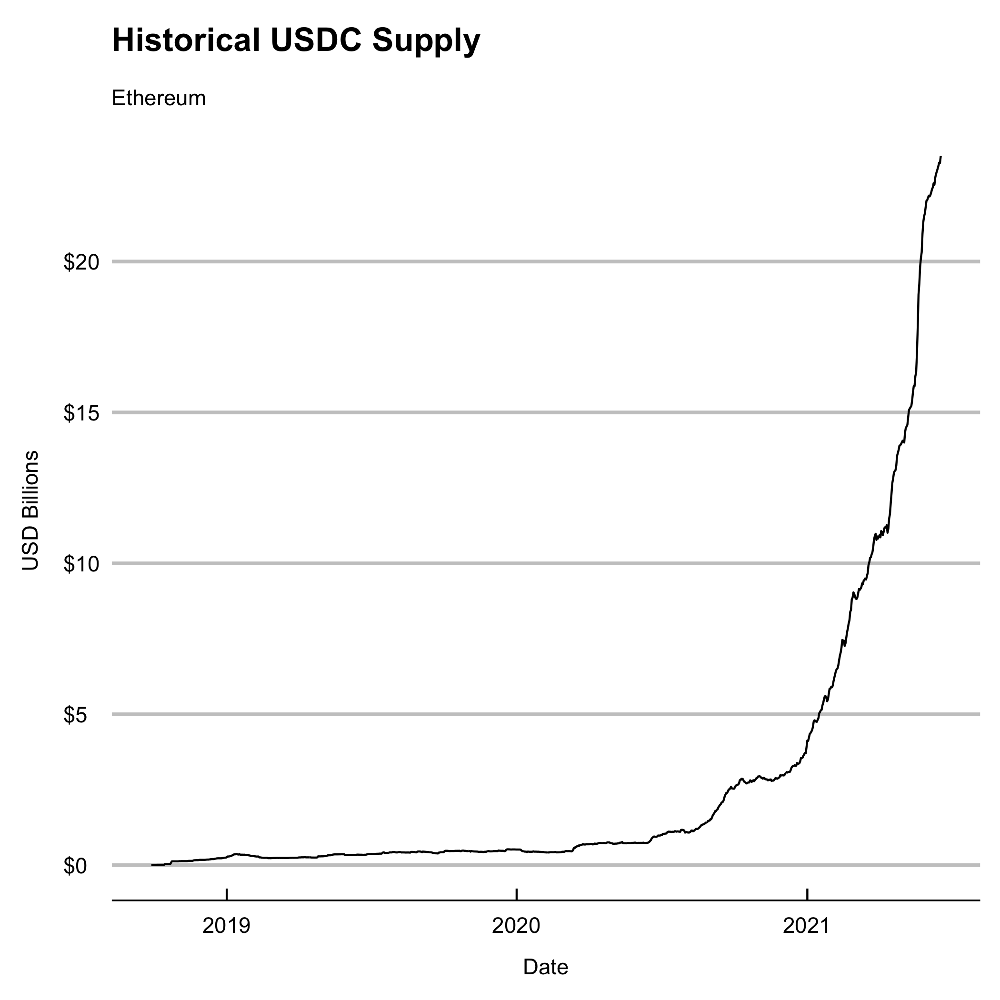

# USDC

[](https://www.repostatus.org/#active)
[](https://cranchecks.info/pkgs/usdc)
[](https://github.com/r-hub/cranlogs.app)
[](https://cran.r-project.org/package=usdc)
[](https://circleci.com/gh/galen211/usdc/tree/master)


`usdc` is an R package that exposes functions to fetch current supply and historical metrics on the USDC stablecoin token.  USDC is issued by the [Centre Consortium](https://www.centre.io/).  The purpose of this package is to make it easy to perform analytics on Centre-issued Stablecoins.  Stablecoins are growing rapidly in adoption, and this package saves time for R users who want to drive straight into data science without having to solve for data collection on multiple blockchains.

This package is under active development and currently only covers historical circulation data on Ethereum.  This package is not an official project of the Centre Consortium and there is no express or implied warranty regarding the accuracy of any information provided through this package.  Detailed information about Centre can be found on their website and in their [whitepaper](https://f.hubspotusercontent30.net/hubfs/9304636/PDF/centre-whitepaper.pdf).  More information about the data sources used to provide current and historical USDC data can be found below.

## Usage

### Current Supply
Print the value of current circulating supply to the console
```r
library(usdc)
print_all_chains()
```
|datetime            |chain    |token_id                                                 |circulating_supply |
|:-------------------|:--------|:--------------------------------------------------------|:------------------|
|2021-06-19 09:20:40 |Ethereum |0xa0b86991c6218b36c1d19d4a2e9eb0ce3606eb48               |$23,523,192,840    |
|2021-06-19 09:20:40 |Algorand |31566704                                                 |$180,804,866       |
|2021-06-19 09:20:40 |Stellar  |GA5ZSEJYB37JRC5AVCIA5MOP4RHTM335X2KGX3IHOJAPP5RE34K4KZVN |$12,896,127        |
|2021-06-19 09:20:40 |Solana   |EPjFWdd5AufqSSqeM2qN1xzybapC8G4wEGGkZwyTDt1v             |$785,000,020       |

Fetch and store the current circulating supply in a tibble data frame
```r
df <- fetch_supply_usdc()
```

### Historical Metrics

Fetch and store the historical supply of USDC on Ethereum in a tibble data frame.  Note that this function support CoinMetric's definitions for metrics.  For more information on CoinMetric's API see, https://docs.coinmetrics.io/api/v4
```r
df <- fetch_historical_ethereum(metric = "CapMrktCurUSD")
tail(df)
```
|date       |       value|measurement   |blockchain |
|:----------|-----------:|:-------------|:----------|
|2021-06-13 | 22983465371|CapMrktCurUSD |Ethereum   |
|2021-06-14 | 23069134166|CapMrktCurUSD |Ethereum   |
|2021-06-15 | 23167467437|CapMrktCurUSD |Ethereum   |
|2021-06-16 | 23276979355|CapMrktCurUSD |Ethereum   |
|2021-06-17 | 23265686419|CapMrktCurUSD |Ethereum   |
|2021-06-18 | 23499032393|CapMrktCurUSD |Ethereum   |

Fetch and store the number of daily active USDC supply on Ethereum in a tibble data frame.  Note that this function uses the CoinMetrics API field `SplyAct1d`.  Other metrics can also be substituted
```r
df <- fetch_historical_ethereum(metric = "SplyAct1d")
tail(df)
```
|date       |       value|measurement |blockchain |
|:----------|-----------:|:-----------|:----------|
|2021-06-13 | 11847179390|SplyAct1d   |Ethereum   |
|2021-06-14 | 12143159721|SplyAct1d   |Ethereum   |
|2021-06-15 | 12515784380|SplyAct1d   |Ethereum   |
|2021-06-16 |  9853525925|SplyAct1d   |Ethereum   |
|2021-06-17 |  9733206839|SplyAct1d   |Ethereum   |
|2021-06-18 |  9667080264|SplyAct1d   |Ethereum   |

### Plotting

Plot the current supply of USDC on each supported blockchain
```r
chart_current_supply_usdc()
```


Plot the current supply of USDC on Ethereum
```r
chart_historical_supply_usdc()
```



## Data sources used by `usdc`

* Current USDC in circulation on each of the officially supported blockchains is provided through the webservices listed below:
    * **Algorand**: [AlgoExplorer](https://algoexplorer.io/) explorer API service
    * **Ethereum**: [Blockchair](https://blockchair.com/) explorer API service
    * **Solana**: [Solana](https://docs.solana.com/developing/clients/jsonrpc-api) JSON RPC API
    * **Stellar**: [Stellar Foundation](https://www.stellar.org/) explorer API service
* Historical USDC metrics are fetched from the [CoinMetrics](https://docs.coinmetrics.io/api/v4) API

## Roadmap
Centre is developing a graphql [subgraph](https://thegraph.com/explorer/subgraph/centrehq/usdc), which may eventually expand the scope of data analysis interfaces that can be provided by this package.  Some ideas for future functionality are described on the roadmap below.

**Roadmap Items:**
 - Track each chain's historical balance of USDC
 - Add additional convenience charts and chart customizations
 - Query the Centre USDC subgraph using the Graph protocol
 - Track USDC token balances deposited in different lending and DEX protocols
