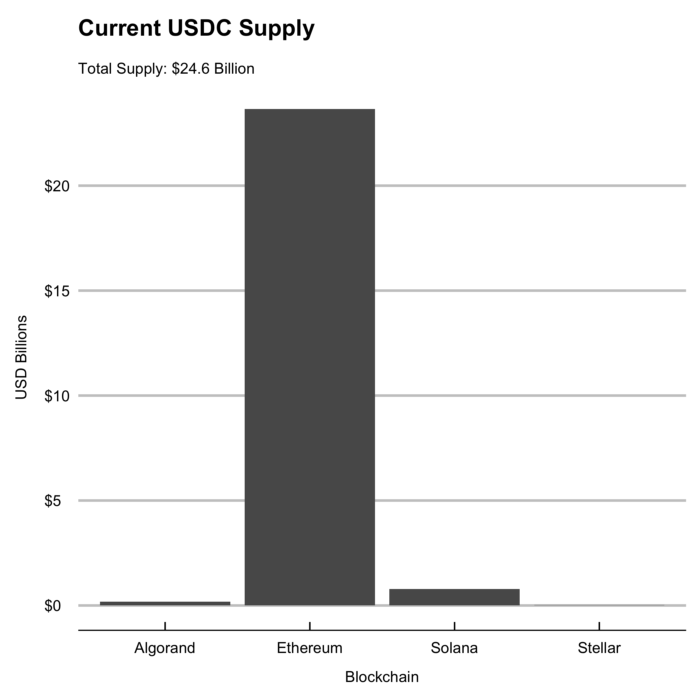

# USDC

[](https://www.repostatus.org/#active)
[](https://cranchecks.info/pkgs/usdc)
[](https://github.com/r-hub/cranlogs.app)
[](https://cran.r-project.org/package=usdc)
[](https://circleci.com/gh/galen211/usdc/tree/master)
[](https://codecov.io/gh/galen211/usdc?branch=master)

Client for data sources to track current and historical 'usdc' circulation on blockchains officially supported by the Centre Consortium (Algorand, Ethereum, Solana, Stellar).  USDC is a dollar-backed stablecoin issued by the [Centre Consortium](https://www.centre.io/).  This package utilizes block explorer APIs to retrieve current circulation data and the Coin Metrics API to retrieve historical metrics.  Additional utility functions are provided for charting and looking up the metrics definitions for Coin Metrics V4 API.

This package is under active development and currently only has coverage for historical circulation data on Ethereum.  This package is not an official project of the Centre Consortium.  Detailed information about Centre can be found on their website and in their [whitepaper](https://f.hubspotusercontent30.net/hubfs/9304636/PDF/centre-whitepaper.pdf).  More information about the data sources used to provide current and historical USDC data can be found below.

## Usage

### Installation
To install via CRAN, run the following command
```
install.packages('usdc')
```

To install via Github, first install `devtools` and then run
```
devtools::install_github('galen211/usdc')
```

### Current Supply
Print the value of current circulating supply to the console
```r
library(usdc)
print_all_chains()
```
|datetime            |chain    |circulating_supply |
|:-------------------|:--------|:------------------|
|2021-07-03 09:40:03 |Ethereum |$24,655,736,469    |
|2021-07-03 09:40:03 |Algorand |$176,118,855       |
|2021-07-03 09:40:03 |Stellar  |$11,249,153        |
|2021-07-03 09:40:03 |Solana   |$785,000,020       |
|2021-07-03 09:40:03 |TRON     |$111,745,328       |

Fetch and store the current circulating supply in a tibble data frame
```r
df <- fetch_supply_usdc()
```

### Historical Metrics

Fetch and store the historical supply of USDC on Ethereum in a tibble data frame.  Note that this function support Coin Metrics' definitions for metrics.  For more information on Coin Metrics' API see, https://docs.coinmetrics.io/api/v4
```r
df <- fetch_historical_ethereum(metric = "CapMrktCurUSD")
tail(df)
```
|date       |       value|measurement   |blockchain |
|:----------|-----------:|:-------------|:----------|
|2021-06-13 | 22983465371|CapMrktCurUSD |Ethereum   |
|2021-06-14 | 23069134166|CapMrktCurUSD |Ethereum   |
|2021-06-15 | 23167467437|CapMrktCurUSD |Ethereum   |
|2021-06-16 | 23276979355|CapMrktCurUSD |Ethereum   |
|2021-06-17 | 23265686419|CapMrktCurUSD |Ethereum   |
|2021-06-18 | 23499032393|CapMrktCurUSD |Ethereum   |

Fetch and store the amount of daily active USDC supply on Ethereum in a tibble data frame.  Note that this function uses the Coin Metrics API field `SplyAct1d`.  Other metrics can also be substituted.
```r
df <- fetch_historical_ethereum(metric = "SplyAct1d")
tail(df)
```
|date       |       value|measurement |blockchain |
|:----------|-----------:|:-----------|:----------|
|2021-06-13 | 11847179390|SplyAct1d   |Ethereum   |
|2021-06-14 | 12143159721|SplyAct1d   |Ethereum   |
|2021-06-15 | 12515784380|SplyAct1d   |Ethereum   |
|2021-06-16 |  9853525925|SplyAct1d   |Ethereum   |
|2021-06-17 |  9733206839|SplyAct1d   |Ethereum   |
|2021-06-18 |  9667080264|SplyAct1d   |Ethereum   |

#### Coin Metrics fields
An internal dataset holds the fields which are currently available through the Coin Metrics API.  To view the dataset, simply type `metrics`.  The example below shows some of the supported fields:
```r
library(usdc)
library(dplyr)
library(knitr)
metrics %>% select(id, description) %>% slice_sample(n=5) %>% kable()
```
|id              |description                                                                                                                                                                                                                                                                                   |
|:---------------|:---------------------------------------------------------------------------------------------------------------------------------------------------------------------------------------------------------------------------------------------------------------------------------------------|
|AdrBal1in10MCnt |The sum count of unique addresses holding at least one ten-millionth ownership of the current supply of native units as of the end of that interval. Only native units are considered (e.g., an address with less than one ten-millionth ETH but with ERC-20 tokens would not be considered). |
|FeeByteMeanNtv  |The mean transaction fee per byte of all blocks that interval in native units.                                                                                                                                                                                                                |
|SplyAdrBalUSD1  |The sum of all native units being held in addresses whose balance was $1 or greater at the end of that interval. Only native units are considered (e.g., an address with less than X ETH but with more than X in ERC-20 tokens would not be considered).                                      |
|BlkSizeMeanByte |The mean size (in bytes) of all blocks created that day.                                                                                                                                                                                                                                      |
|FeeTotUSD       |The sum USD value of all fees paid to miners that interval. Fees do not include new issuance.                                                                                                                                                                                                 |


### Plotting

Plot the current supply of USDC on each supported blockchain
```r
chart_current_supply_usdc()
```



Plot the current supply of USDC on Ethereum
```r
chart_historical_supply_usdc()
```


## Data sources used by `usdc`

* Current USDC in circulation on each of the officially supported blockchains is provided through the webservices listed below:
    * **Algorand**: [AlgoExplorer](https://algoexplorer.io/) explorer API service
    * **Ethereum**: [Blockchair](https://blockchair.com/) explorer API service
    * **Solana**: [Solana](https://docs.solana.com/developing/clients/jsonrpc-api) JSON RPC API
    * **Stellar**: [Stellar Foundation](https://www.stellar.org/) explorer API service
    * **TRON**: [TRON Scan](https://tronscan.org/#/) explorer API service
* Historical USDC metrics are fetched from the [Coin Metrics](https://docs.coinmetrics.io/api/v4) API

## Changelog
 - `7/3/2021`: added basic http error catching logic and TRON blockchain USDC supply

## Roadmap
Centre is developing a graphql [subgraph](https://thegraph.com/explorer/subgraph/centrehq/usdc), which may eventually expand the scope of data analysis interfaces that can be provided by this package.  Some ideas for future functionality are described on the roadmap below.

**Roadmap Items:**
 - Track each chain's historical balance of USDC
 - Add additional convenience charts and chart customizations
 - Query the Centre USDC subgraph using the Graph protocol
 - Track USDC token balances deposited in different lending and DEX protocols
